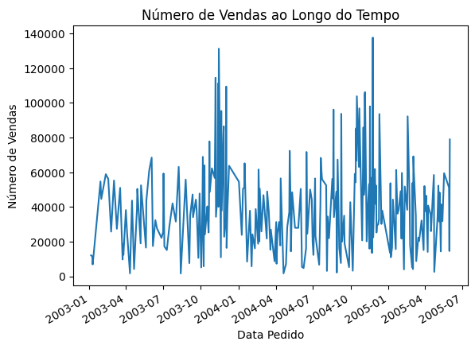
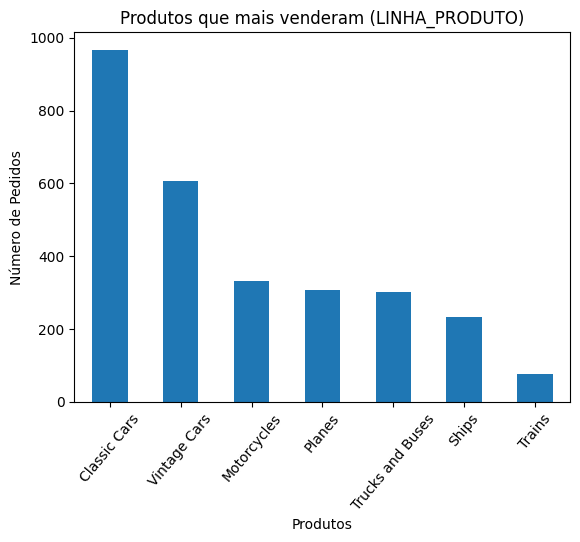
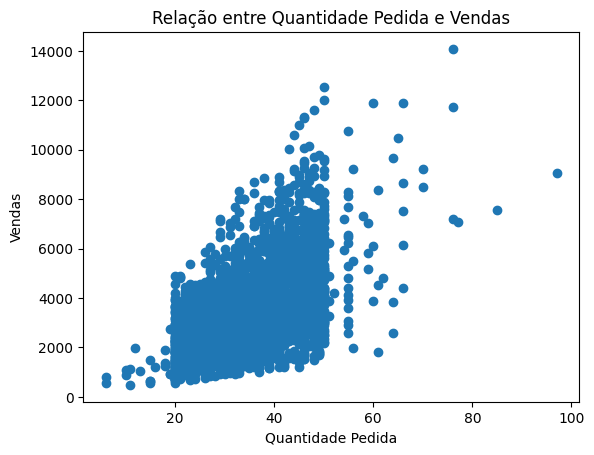

# Analise Exploratória de Vendas — Mini Projeto Python

> Projeto desenvolvido durante o **Programa Desenvolve**, uma parceria entre o **Grupo Boticário** e a **Escola Koru**, com foco em formação e inclusão de talentos em tecnologia.

---

## Contexto

foi criado como parte da trilha de dados dentro do **Programa Desenvolve**. O objetivo principal foi realizar a Análise Exploratória de Dados de um conjunto de dados de vendas fornecido pelos professores, aplicando conceitos que vão desde a lógica de programação até a manipulação e visualização de dados com bibliotecas analíticas.

## Objetivo

Aplicar conceitos fundamentais de Python para Análise de Dados utilizando uma base de vendas.

---

## Estrutura do Projeto

```
Mini_Projeto_Analise_Dados/
│
├── Mini_Projeto_Analise_Dados.ipynb
├── README.md
├── requirements.txt
└── imagens/
    ├── vendas_tempo.png
    ├── produtos_mais_vendidos.png
    └── quantidade_vs_vendas.png
```

## Conceitos Aplicados

- Listas
- Tuplas
- Dicionários
- Estruturas condicionais
- Laços de repetição
- Pandas
- NumPy
- Análise Exploratória de Dados (EDA)
- Visualização de Dados com Matplotlib

## Principais Análises

- Identificação de dados nulos
- Estatísticas da base
- Produtos mais vendidos
- Evolução temporal das vendas
- Relação entre quantidade vendida e faturamento

## Tecnologias

- Python
- Pandas
- NumPy
- Matplotlib
- Google Colab

## Análise Gráfica e Visualizações

### 1. Evolução Temporal das Vendas



### 2. Produtos Mais Vendidos



### 3. Relação entre Quantidade e Faturamento



# Conclusões

- Classic Cars foi a linha de produto mais vendida.
- As vendas apresentaram maior volume nos últimos meses do ano.
- Existe relação positiva entre quantidade vendida e valor faturado.
- Foram identificados valores nulos em algumas colunas da base.

O projeto permitiu compreender técnicas iniciais de exploração de dados e geração de insights através de visualizações gráficas.