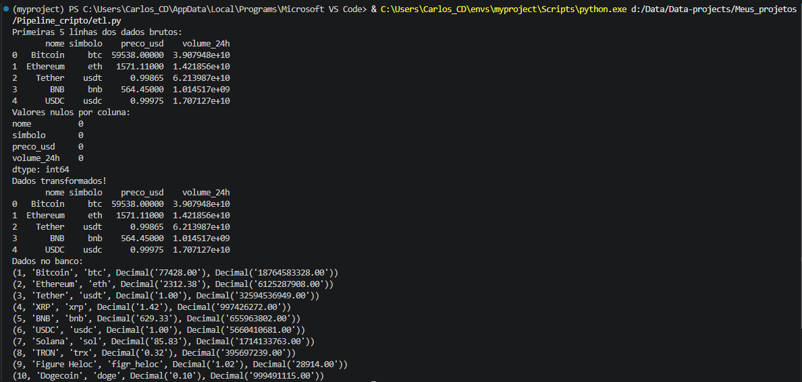
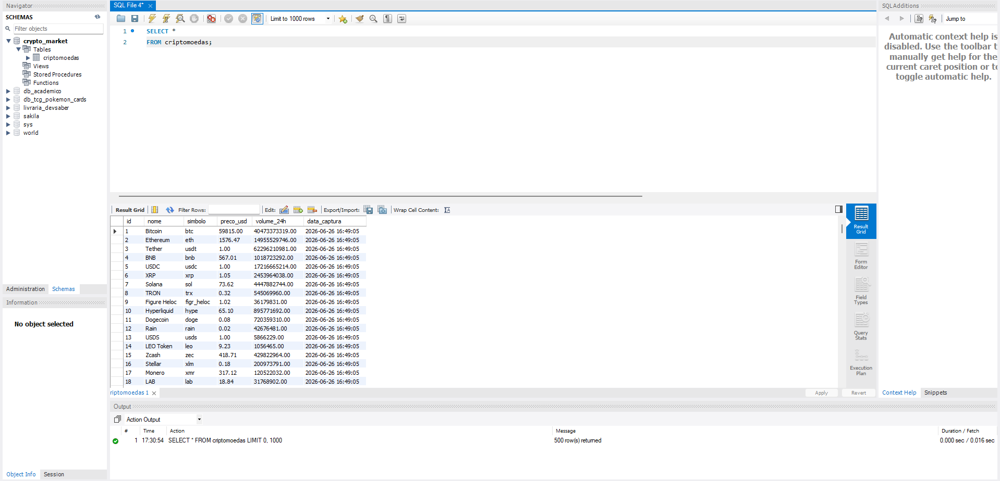
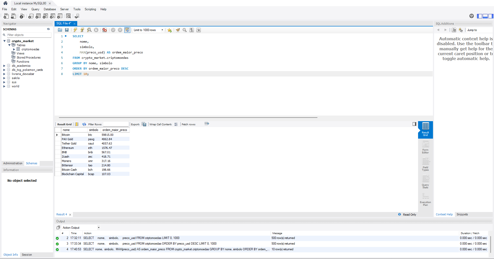
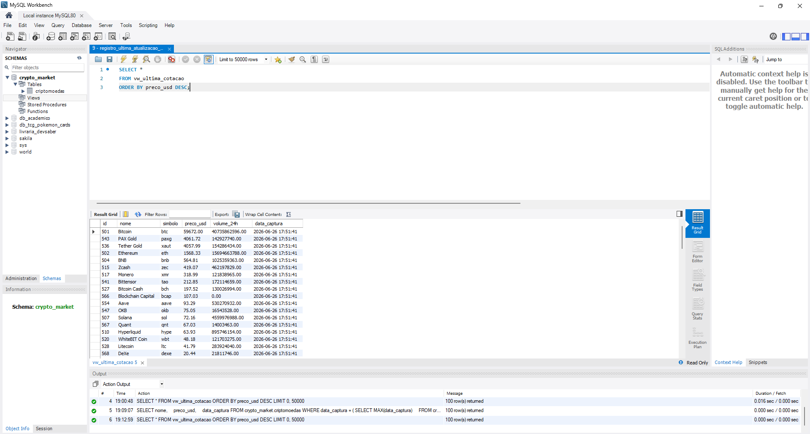

# 🪙 Crypto Market ETL Pipeline

> Pipeline de dados end-to-end que extrai cotações de criptomoedas em tempo real, transforma e carrega em banco MySQL — com análises via SQL.


---

## 📌 Sobre o Projeto

Este projeto demonstra um **pipeline ETL completo**, desde a ingestão de dados de uma API pública até a análise via SQL — cobrindo as etapas fundamentais da engenharia de dados.

**O que foi construído:**

- Consumo da API REST [CoinGecko](https://www.coingecko.com/en/api) para obter as 100 criptomoedas com maior capitalização de mercado
- Transformação e limpeza dos dados com **Pandas** (seleção de colunas, tratamento de nulos, normalização de strings)
- Carga otimizada em banco **MySQL** com `executemany` para performance em lote
- Infraestrutura criada automaticamente via SQL (`CREATE IF NOT EXISTS`)
- Análises exploratórias com **10+ queries SQL** (rankings, filtros, subqueries, views, histórico de preços)

---

## 🛠️ Tecnologias Utilizadas

| Tecnologia | Finalidade |
|---|---|
| Python 3.8+ | Linguagem principal do pipeline |
| Pandas | Transformação e limpeza dos dados |
| Requests | Consumo da API CoinGecko |
| MySQL | Armazenamento e análise dos dados |
| mysql-connector-python | Conexão Python ↔ MySQL |
| python-dotenv | Gerenciamento seguro de credenciais |

---

## 🗂️ Estrutura do Projeto

```
crypto-market-etl/
│
├── etl.py                # Pipeline principal (Extract → Transform → Load)
├── requirements.txt      # Dependências do projeto
├── .env.example          # Modelo de variáveis de ambiente
├── .gitignore
│
├── queries/              # Scripts SQL de análise
│   ├── 1_tabela_geral.sql
│   ├── 2_select_apenas_interesse.sql
│   ├── 3_top10_maior_valor.sql
│   ├── 4_max_min_media.sql
│   ├── 5_preco_menor_1000.sql
│   ├── 6_preco_maior_1000.sql
│   ├── 7_top5_maior_volume.sql
│   ├── 8_historico_bitcoin.sql
│   ├── 9_registro_ultima_atualizacao.sql
│   └── 10_create_view.sql
│
└── imagens/              # Prints das queries executadas no MySQL Workbench
```

---

## 🔄 Arquitetura do Pipeline

```
┌─────────────────────┐
│   CoinGecko API     │  ← Top 100 criptomoedas por market cap
└────────┬────────────┘
         │ requests.get()
         ▼
┌─────────────────────┐
│     EXTRAÇÃO        │  ← response.json() → lista de dicionários
└────────┬────────────┘
         │ pd.DataFrame()
         ▼
┌─────────────────────┐
│   TRANSFORMAÇÃO     │  ← Seleção de colunas, fillna(0), slice de strings
└────────┬────────────┘
         │ executemany()
         ▼
┌─────────────────────┐
│       CARGA         │  ← MySQL: banco crypto_market, tabela criptomoedas
└─────────────────────┘
```

---

## 🗃️ Estrutura do Banco de Dados

**Banco:** `crypto_market` | **Tabela:** `criptomoedas`

| Coluna | Tipo | Descrição |
|---|---|---|
| `id` | INT (PK, AUTO_INCREMENT) | Identificador único |
| `nome` | VARCHAR(255) | Nome da criptomoeda |
| `simbolo` | VARCHAR(10) | Símbolo (BTC, ETH...) |
| `preco_usd` | DECIMAL(18,2) | Preço em dólares |
| `volume_24h` | DECIMAL(18,2) | Volume negociado em 24h |
| `data_captura` | TIMESTAMP | Data/hora da coleta |

> A coluna `data_captura` viabiliza histórico de preços ao executar o pipeline múltiplas vezes.

---

## 📊 Análises SQL Desenvolvidas

| # | Query | Técnica |
|---|---|---|
| 1 | Visualização geral da tabela | `SELECT *` |
| 2 | Apenas colunas de interesse | Projeção de colunas |
| 3 | Top 10 moedas por maior preço | `ORDER BY`, `LIMIT`, `GROUP BY` |
| 4 | Mín, máx e média de preços por símbolo | `MIN()`, `MAX()`, `AVG()` |
| 5 | Moedas com preço < $1.000 (última captura) | `WHERE`, subquery com `MAX()` |
| 6 | Moedas com preço > $1.000 (última captura) | `WHERE`, subquery com `MAX()` |
| 7 | Top 5 moedas por maior volume (24h) | `ORDER BY`, subquery |
| 8 | Histórico de preço do Bitcoin | Filtro por `simbolo` |
| 9 | Registro da última atualização do DB | `MAX(data_captura)` |
| 10 | View `vw_ultima_cotacao` | `CREATE VIEW`, `JOIN` |

---

## 🖼️ Screenshots

### Pipeline executando no terminal


### Dados carregados no MySQL


### Top 10 moedas por maior valor


### View `vw_ultima_cotacao` em execução


---

## 🚀 Como Executar

### Pré-requisitos

- Python 3.8+
- MySQL Server (local ou em nuvem)

### 1. Clone o repositório

```bash
git clone https://github.com/seu-usuario/crypto-market-etl.git
cd crypto-market-etl
```

### 2. Instale as dependências

```bash
pip install -r requirements.txt
```

### 3. Configure as variáveis de ambiente

```bash
cp .env.example .env
```

Edite o `.env` com suas credenciais:

```env
HOST=localhost
USER=seu_usuario_mysql
PASSWORD=sua_senha_mysql
```

### 4. Execute o pipeline

```bash
python etl.py
```

O script irá:
1. Criar o banco e a tabela automaticamente (se não existirem)
2. Consumir a API CoinGecko
3. Transformar os dados
4. Inserir no MySQL
5. Exibir os 10 primeiros registros como validação

---

## ✅ Boas Práticas Adotadas

- **Segurança:** credenciais protegidas via `.env`, nunca versionadas
- **Performance:** inserção em lote com `executemany` ao invés de INSERT por linha
- **Robustez:** infraestrutura criada com `CREATE IF NOT EXISTS` — seguro para re-execuções
- **Qualidade de dados:** tratamento de nulos com `fillna(0)` e limitação de strings antes da carga
- **Rastreabilidade:** `data_captura` automático permite histórico e auditoria

---

## 📈 Possíveis Melhorias

- [ ] Agendamento com **Apache Airflow** ou **cron job**
- [ ] Tratamento de erros com `try/except` e logging estruturado (`logging` module)
- [ ] Migração para banco em nuvem (AWS RDS, Google Cloud SQL)
- [ ] Dashboard de visualização com **Streamlit** ou **Power BI**
- [ ] Conteinerização com **Docker** para portabilidade
- [ ] Testes unitários com **pytest**

---

## 📦 Dependências

```
requests
pandas
mysql-connector-python
python-dotenv
```

---

## 👤 Autor

Desenvolvido por **Carlos CD**

[](https://linkedin.com/in/seu-perfil)
[](https://github.com/seu-usuario)
